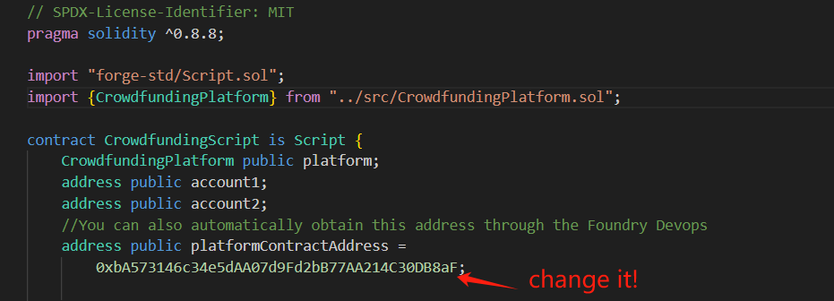

[中文文档](./README-CN.md)

# A Multi-Chain Crowdfunding Platform Smart Contract Development, Testing, and Deployment

## About the Project

Recently, I have been reviewing my contract development notes and trying to share them through blogs and GitHub to connect with more web3/blockchain enthusiasts for discussion.

This time, I'm sharing a project called ChainFund, a decentralized crowdfunding platform for Ethereum and other EVM-compatible chains, focusing on early-stage fundraising.

The platform has core features such as project creation, project management, fundraising, fund withdrawal, fund refund, and platform fee collection.

ChainFund's contract code is open source. The contract development uses the Solidity language and the Foundry framework for efficient smart contract development, providing project contracts, unit tests, integration tests, interaction tests, and multi-EVM compatible chain deployment scripts. If you want to build a decentralized crowdfunding platform or learn smart contract development, this is a great resource.

GitHub link:https://github.com/jackie-cn/ChainFund

Ethereum contract address: [0xfdd15a5eb2a31773be8c0481e0dd26aebd8667fb](https://sepolia.etherscan.io/address/0xfdd15a5eb2a31773be8c0481e0dd26aebd8667fb)

BSC contract address: [0x103dab21201672cdec9ed25546d1c140ef3bfe11](https://testnet.bscscan.com/address/0x103dab21201672cdec9ed25546d1c140ef3bfe11)

Arbitrum contract address: [0x06d9170d6e6f7bc7536351dd7b7dbb7042aabde4](https://sepolia.arbiscan.io/address/0x06d9170d6e6f7bc7536351dd7b7dbb7042aabde4)

## Built With

**Technologies**: Solidity, Foundry

**Supported Chains**: EVM-compatible chains. This article demonstrates testing and deployment on Ethereum Sepolia, BSC Testnet, and Arbitrum Testnet.

## Getting Started

### Prerequisites

1. Basic knowledge of Solidity development and installation of [Foundry](https://book.getfoundry.sh/getting-started/installation).
2. Obtain RPC-URLs, test tokens, and blockchain explorer API keys for different chains, depending on which chain you want ChainFund to use.

If you only want to use one chain, I recommend Ethereum Sepolia:
- [RPC-URL Link](https://dashboard.alchemy.com/)
- [Token Faucet Link](https://www.alchemy.com/faucets/Ethereum-sepolia)
- [Blockchain Explorer API-Key Link](https://etherscan.io/myapikey)

3. Prepare three wallet addresses and deposit test tokens into them: one for deployment and two for on-chain interaction testing.

### Installation

1. **Clone the repository**

    ```
    git clone https://github.com/jackie-cn/ChainFund.git
    ```

2. **Modify .env**

    Create a .env file in the project directory and fill it out according to .env-example

    ```
    ETH_SPEOLIA_RPC_URL=""
    ETH_API_KEY=""
    BSC_TESTNET_RPC=""
    BSC_API_KEY=""
    ARBITRUM_SPEOLIA_RPC_URL=""
    ARBITRUM_API_KEY=""
    DEPLOY_PRIVATE_KEY=""
    USER1_PRIVATE_KEY=""
    USER2_PRIVATE_KEY=""
    ```

    **Note:**
    - Write the wallet private key in the .env file and remember to add .env to .gitignore to avoid exposing it on GitHub.
    - In actual development, it is not recommended to write keys directly in plain text in the .env file. You can use Foundry's keyStore.

3. **Install project dependencies and compile**

    ```
    foundry install
    ```

    ```
    foundry build
    ```

### Usage

**1. Run all local tests:**

    forge test

**2. Run all local fork chain tests**

    forge test --rpc-url ${ETH_SPEOLIA_RPC_URL}

**3. Multi-chain deployment and code verification**

First, run

    source .env

Deploy to Ethereum Sepolia chain:

    forge script ./script/DeployCrowdfundingPlatform.s.sol --rpc-url ${ETH_SPEOLIA_RPC_URL} --private-key ${DEPLOY_PRIVATE_KEY} --broadcast --verify -vvvv --legacy --etherscan-api-key ${ETH_API_KEY}

Deploy to BSC Testnet:

    forge script ./script/DeployCrowdfundingPlatform.s.sol --rpc-url ${BSC_TESTNET_RPC} --private-key ${DEPLOY_PRIVATE_KEY} --broadcast --verify -vvvv --legacy --etherscan-api-key ${BSC_API_KEY}

Deploy to Arbitrum Sepolia chain:

    forge script ./script/DeployCrowdfundingPlatform.s.sol --rpc-url ${ARBITRUM_SPEOLIA_RPC_URL} --private-key ${DEPLOY_PRIVATE_KEY} --broadcast --verify -vvvv --legacy --etherscan-api-key ${ARBITRUM_API_KEY}

**4. Execute on-chain interaction test scripts**

Write the contract address deployed on the chain into OnchainInteract.s.sol



    forge script ./script/OnchainInteract.s.sol --rpc-url ${ETH_SPEOLIA_RPC_URL} --broadcast -vvvv --legacy

To execute on different chains, replace **ETH_SPEOLIA_RPC_URL** with the corresponding chain's RPC_URL.


# Code Introduce

## platform smart contract

```js
// SPDX-License-Identifier: MIT
pragma solidity ^0.8.8;

contract CrowdfundingPlatform {
    address public platformAdmin;

    enum ProjectStatus {
        Active,
        Cancelled,
        Finished
    }

    struct Project {
        uint256 projectID;
        address projectOwner;
        string title;
        string description;
        uint256 fundingGoal;
        uint256 totalFunded;
        uint256 endTime;
        ProjectStatus status;
    }

    uint256 public feePercentage;
    Project[] public projects;
    bool private locked = false;
    mapping(uint256 => mapping(address => uint256)) public contributions;

    event ProjectCreated(uint256 indexed projectID, address creator);
    event FundReceived(
        uint256 indexed projectID,
        address sender,
        uint256 amount
    );
    event ProjectCancelled(uint256 indexed projectID);
    event FundWithdraw(
        uint256 indexed projectID,
        address sender,
        uint256 amount
    );
    event Refund(uint256 indexed projectID, address sender, uint256 amount);

    constructor() {
        platformAdmin = msg.sender;
        feePercentage = 5;
    }

    modifier onlyOwner() {
        require(msg.sender == platformAdmin, "Caller is not the owner");
        _;
    }

    modifier noReentrant() {
        require(!locked, "Reentrant call detected");
        locked = true;
        _;
        locked = false;
    }

    /**
     * @notice Create a new crowdfunding project by anyone
     * @param _title  project title
     * @param _description  description about the project
     * @param _fundingGoal total money need to be funded
     * @param _duration  crowdfunding duration
     * @return projectId  projectId
     */
    function createProject(
        string memory _title,
        string memory _description,
        uint256 _fundingGoal,
        uint256 _duration
    ) external returns (uint) {
        uint256 projectId = projects.length;
        Project storage newProject = projects.push();
        newProject.projectID = projectId;
        newProject.projectOwner = msg.sender;
        newProject.title = _title;
        newProject.description = _description;
        newProject.fundingGoal = _fundingGoal;
        newProject.totalFunded = 0;
        newProject.endTime = block.timestamp + _duration;
        newProject.status = ProjectStatus.Active;
        emit ProjectCreated(projectId, msg.sender);
        return projectId;
    }

    /**
     * @notice fund the project
     * @param _projectID ID of project
     */
    function fundProject(uint256 _projectID) external payable {
        Project storage project = projects[_projectID];
        // Check if the end time has not been reached and the funding goal is not met
        require(block.timestamp < project.endTime, "Funding period has ended");

        // Check if the project funding goal has been reached or exceeded
        require(
            project.totalFunded < project.fundingGoal,
            "Funding goal has been reached or exceeded"
        );
        require(
            project.status != ProjectStatus.Finished,
            "project was sucessed and finshed"
        );
        require(
            project.status != ProjectStatus.Cancelled,
            "project was cancelled by creator"
        );
        // Check if the sent amount is greater than zero
        require(msg.value > 0, "Funding amout must be greater than 0");
        contributions[_projectID][msg.sender] += msg.value;
        project.totalFunded += msg.value;
        emit FundReceived(_projectID, msg.sender, msg.value);
    }

    /**
     * @notice when reach the endtime but not get the fundingGoal or
     * project creator canel the project, user can call the refund to
     * get money back
     * @param _projectID ID of project
     */
    function refund(uint256 _projectID) external noReentrant {
        Project storage project = projects[_projectID];
        require(
            project.status != ProjectStatus.Finished,
            "Funding is Success and the project creator withraw the fund"
        );
        // If the project is still active but the end time has not been reached
        if (project.status == ProjectStatus.Active) {
            require(block.timestamp > project.endTime, "not reach the endTime");
            require(
                project.totalFunded < project.fundingGoal,
                "Funding had reached the goal"
            );
        }
        uint256 funderAmount = getContribution(_projectID);
        require(
            project.totalFunded >= funderAmount && funderAmount != 0,
            "not enough to refund!"
        );
        project.totalFunded -= funderAmount;
        contributions[_projectID][msg.sender] -= funderAmount;
        (bool success, ) = msg.sender.call{value: funderAmount}("");
        if (!success) {
            revert("refund failed!");
        }
        emit Refund(_projectID, msg.sender, funderAmount);
    }

    /**
     * @notice cancel the project fungding
     * @param _projectID ID of project
     */
    function cancalProject(uint256 _projectID) external {
        Project storage project = projects[_projectID];
        require(
            project.projectOwner == msg.sender,
            "Caller is not the project owner!"
        );
        project.status = ProjectStatus.Cancelled;
        emit ProjectCancelled(_projectID);
    }

    /**
     * @notice withdraw the project fungding
     * @param _projectID ID of project
     */
    function withdraw(uint256 _projectID) external noReentrant {
        Project storage project = projects[_projectID];
        require(
            project.projectOwner == msg.sender,
            "Caller is not the project owner!"
        );
        require(
            project.status == ProjectStatus.Active,
            "the project were finished or cancelled "
        );
        uint256 projectTotalFunded = project.totalFunded;
        require(
            projectTotalFunded >= project.fundingGoal,
            "crowfund not reach the goal"
        );
        uint256 paltformFee = (projectTotalFunded * feePercentage) / 100;
        project.totalFunded = 0;
        project.status = ProjectStatus.Finished;
        // Pay platform fee
        (bool success, ) = platformAdmin.call{value: paltformFee}("");
        if (!success) {
            revert("pay platform fee failed!");
        }
        // Transfer funds to project owner
        (success, ) = msg.sender.call{value: projectTotalFunded - paltformFee}(
            ""
        );
        if (!success) {
            revert("refund failed!");
        }
        emit FundWithdraw(
            _projectID,
            msg.sender,
            projectTotalFunded - paltformFee
        );
    }

    function getContribution(uint256 _projectID) public view returns (uint256) {
        return contributions[_projectID][msg.sender];
    }

    function setPlatformFee(uint256 _feePercentage) external onlyOwner {
        feePercentage = _feePercentage;
    }

    function transferOwnership(address _newAdmin) external onlyOwner {
        platformAdmin = _newAdmin;
    }

    function getProjectFundedAmout(
        uint256 _projectID
    ) external view returns (uint256) {
        Project memory project = projects[_projectID];
        return project.totalFunded;
    }

    function getProjectEndTime(
        uint256 _projectID
    ) external view returns (uint256) {
        Project memory project = projects[_projectID];
        return project.endTime;
    }

    function getProjectFundingGoal(
        uint256 _projectID
    ) external view returns (uint256) {
        Project memory project = projects[_projectID];
        return project.fundingGoal;
    }

    function getProjectStatus(
        uint256 _projectID
    ) external view returns (ProjectStatus) {
        Project memory project = projects[_projectID];
        return project.status;
    }

    function getProjectCount() public view returns (uint) {
        return projects.length;
    }

    fallback() external payable {}

    receive() external payable {}
}

```

### Contract Summary

- **Platform Admin:** `address public platformAdmin`
- **Project Status:** `enum ProjectStatus { Active, Cancelled, Finished }`
- **Project Structure:** Contains project ID, project owner, title, description, funding goal, amount raised, end time, status
- **Events:** `ProjectCreated`, `FundReceived`, `ProjectCancelled`, `FundWithdraw`, `Refund`

### Main Functions

- `createProject(string memory _title, string memory _description, uint256 _fundingGoal, uint256 _duration)`: Creates a project
- `fundProject(uint256 _projectID)`: Funds a project
- `refund(uint256 _projectID)`: Refunds a project
- `cancelProject(uint256 _projectID)`: Cancels a project
- `withdraw(uint256 _projectID)`: Withdraws funds
- `getContribution(uint256 _projectID)`: Gets contributions
- `setPlatformFee(uint256 _feePercentage)`: Sets the platform fee
- `transferOwnership(address _newAdmin)`: Transfers ownership
- `getProjectFundedAmount(uint256 _projectID)`: Gets the funded amount of a project
- `getProjectEndTime(uint256 _projectID)`: Gets the end time of a project
- `getProjectFundingGoal(uint256 _projectID)`: Gets the funding goal of a project
- `getProjectStatus(uint256 _projectID)`: Gets the status of a project
- `getProjectCount()`: Gets the number of projects

## UnitTest

```js
// SPDX-License-Identifier: MIT
pragma solidity ^0.8.8;

import {Test, console} from "forge-std/Test.sol";
import {DeployCrowdfundingPlatform} from "../script/DeployCrowdfundingPlatform.s.sol";
import {CrowdfundingPlatform} from "../src/CrowdfundingPlatform.sol";

contract CrowdFundingUnitTest is Test {
    DeployCrowdfundingPlatform public deployCrowdfundingPlatform;
    CrowdfundingPlatform public platform;
    address platformAdmin;
    address projectOwner1;
    address user1;
    address user2;
    uint duration;
    uint fundGoal;
    event ProjectCreated(uint256 indexed projectID, address creator);
    event FundReceived(
        uint256 indexed projectID,
        address sender,
        uint256 amount
    );
    event ProjectCancelled(uint256 indexed projectID);
    event FundWithdraw(
        uint256 indexed projectID,
        address sender,
        uint256 amount
    );
    event Refund(uint256 indexed projectID, address sender, uint256 amount);

    function setUp() external {
        //deploy the Crowdfunding contract
        deployCrowdfundingPlatform = new DeployCrowdfundingPlatform();
        platform = deployCrowdfundingPlatform.deployCrowdfundingPlatform();
        vm.prank(platform.platformAdmin());
        platform.transferOwnership(platformAdmin);
        user1 = address(0x123);
        user2 = address(0x234);
        projectOwner1 = address(0x12341);
        duration = 3600;
        fundGoal = 1000 ether;

        // Set initial balances, set this to avoid the fork test problem
        //because the initial balances of the accounts in the forked testing
        //environment are different from those in the local environment.
        vm.deal(platformAdmin, 0);
        vm.deal(user1, 0);
        vm.deal(user2, 0);
        vm.deal(projectOwner1, 0);
    }

    function testCreateProject() external {
        vm.expectEmit(true, false, false, true);
        emit ProjectCreated(0, address(this));
        platform.createProject(
            "Test Project",
            "Test Description",
            fundGoal,
            duration
        );

        (
            uint projectID,
            address projectOwner,
            string memory title,
            string memory description,
            uint fundingGoal,
            uint totalFunded,
            uint endTime,
            CrowdfundingPlatform.ProjectStatus status
        ) = platform.projects(0);

        assertEq(projectID, 0);
        assertEq(projectOwner, address(this));
        assertEq(title, "Test Project");
        assertEq(description, "Test Description");
        assertEq(fundingGoal, fundGoal);
        assertEq(totalFunded, 0);
        assertGt(endTime, 0);
        assertEq(uint(status), uint(CrowdfundingPlatform.ProjectStatus.Active));
    }

    modifier createProject() {
        vm.prank(projectOwner1);
        platform.createProject(
            "Test Project",
            "Test Description",
            1000 ether,
            3600
        );
        _;
    }

    function testFundProject() external createProject {
        uint amount = 1 ether;
        // test fund function and the event
        vm.startPrank(user1);
        vm.deal(user1, amount);
        vm.expectEmit(true, true, true, true);
        emit FundReceived(0, user1, amount);
        platform.fundProject{value: amount}(0);

        //test the state after funding
        assertEq(platform.getContribution(0), amount);
        assertEq(platform.getProjectFundedAmout(0), amount);
        vm.stopPrank();
    }

    //测试资助项目错误条件：众筹时间到达
    function testProjectRevertAfterEndTime() external createProject {
        uint amount = 1 ether;

        //set the blockTime
        vm.warp(block.timestamp + duration + 1);
        //test fund
        vm.prank(user1);
        vm.deal(user1, amount);
        vm.expectRevert("Funding period has ended");
        platform.fundProject{value: amount}(0);
    }

    function testProjectRevertAfterReachGoal() external createProject {
        //fill the fund pool to reach the fundingGoal
        vm.prank(user1);
        vm.deal(user1, fundGoal);
        platform.fundProject{value: fundGoal}(0);
        // test fund
        vm.prank(user2);
        vm.deal(user2, 1 ether);
        vm.expectRevert("Funding goal has been reached or exceeded");
        platform.fundProject{value: 1 ether}(0);
    }

    function testFundProjectRevertZeroAmount() external createProject {
        vm.prank(user1);
        vm.expectRevert("Funding amout must be greater than 0");
        platform.fundProject{value: 0 ether}(0);
    }

    function testFundProjectRevertWhenFinished() external createProject {
        uint amount = fundGoal;

        vm.prank(user1);
        vm.deal(user1, amount);
        platform.fundProject{value: amount}(0);

        vm.prank(projectOwner1);
        platform.withdraw(0);

        vm.prank(user2);
        vm.deal(user2, 1 ether);
        vm.expectRevert("project was sucessed and finshed");
        platform.fundProject{value: 1 ether}(0);
    }

    function testFundProjectRevertWhenCancelled() external createProject {
        uint amount = 1 ether;

        vm.prank(projectOwner1);
        platform.cancalProject(0);

        vm.prank(user1);
        vm.deal(user1, amount);
        vm.expectRevert("project was cancelled by creator");
        platform.fundProject{value: amount}(0);
    }

    function testCancelProject() external createProject {
        vm.startPrank(projectOwner1);
        vm.expectEmit(true, true, true, true);
        emit ProjectCancelled(0);
        platform.cancalProject(0);
        vm.stopPrank();

        (, , , , , , , CrowdfundingPlatform.ProjectStatus status) = platform
            .projects(0);
        assertEq(
            uint(status),
            uint(CrowdfundingPlatform.ProjectStatus.Cancelled)
        );
    }

    function testCancelProjectRevertNotOwner() external createProject {
        vm.prank(user1);
        vm.expectRevert("Caller is not the project owner!");
        platform.cancalProject(0);
    }

    function testRefund() external createProject {
        uint amount = 1 ether;

        vm.prank(user1);
        vm.deal(user1, amount);
        platform.fundProject{value: amount}(0);

        vm.startPrank(user2);
        vm.deal(user2, amount * 2);
        platform.fundProject{value: amount}(0);

        vm.warp(block.timestamp + duration + 1);

        uint user2Balance = user2.balance;
        uint fundedAmount = platform.getProjectFundedAmout(0);
        console.log(user2Balance, fundedAmount);
        assertEq(user2Balance, amount * 2 - amount);
        assertEq(fundedAmount, amount * 2);

        vm.expectEmit(true, true, true, true);
        emit Refund(0, user2, amount);
        platform.refund(0);

        assertEq(user2.balance, user2Balance + amount);
        assertEq(platform.getProjectFundedAmout(0), fundedAmount - amount);
        assertEq(platform.getContribution(0), 0);
        vm.stopPrank();
    }

    function testRefundRevertNotEndTime() external createProject {
        uint amount = 1 ether;

        vm.prank(user1);
        vm.deal(user1, amount);
        platform.fundProject{value: amount}(0);

        vm.prank(user1);
        vm.expectRevert("not reach the endTime");
        platform.refund(0);
    }

    function testRefundRevertWhenFinished() external createProject {
        uint amount = fundGoal;

        vm.prank(user1);
        vm.deal(user1, amount);
        platform.fundProject{value: amount}(0);

        vm.prank(projectOwner1);
        platform.withdraw(0);

        console.log(uint(platform.getProjectStatus(0)));

        vm.prank(user1);
        vm.expectRevert(
            "Funding is Success and the project creator withraw the fund"
        );
        platform.refund(0);
    }

    function testRefundRevertNoContribution() external createProject {
        vm.startPrank(user1);
        vm.warp(block.timestamp + duration + 1);
        console.log("contribution:", platform.getContribution(0));
        vm.expectRevert("not enough to refund!");
        platform.refund(0);
        vm.stopPrank();
    }

    function testWithdraw() external createProject {
        uint amount = fundGoal;
        uint feePercentage = platform.feePercentage();

        vm.prank(user1);
        vm.deal(user1, amount);
        platform.fundProject{value: amount}(0);

        vm.startPrank(projectOwner1);
        uint projectFundedAmout = platform.getProjectFundedAmout(0);
        uint withdrawFee = (projectFundedAmout * feePercentage) / 100;
        // console.log("projectFundedAmout", projectFundedAmout);
        // console.log("withdrawFee:", withdrawFee);
        vm.expectEmit(true, true, true, true);
        emit FundWithdraw(0, projectOwner1, projectFundedAmout - withdrawFee);
        platform.withdraw(0);

        assertEq(platform.getProjectFundedAmout(0), 0);
        // console.log("platformAdmin.balance:", platformAdmin.balance);
        assertEq(address(platformAdmin).balance, withdrawFee);
        assertEq(
            address(projectOwner1).balance,
            projectFundedAmout - withdrawFee
        );
        vm.stopPrank();
    }

    function testWithdrawRevertNotOwner() external createProject {
        vm.prank(user1);
        vm.expectRevert("Caller is not the project owner!");
        platform.withdraw(0);
    }

    function testWithdrawRevertNotActive() external createProject {
        uint amount = fundGoal;

        vm.prank(user1);
        vm.deal(user1, amount);
        platform.fundProject{value: amount}(0);

        vm.prank(projectOwner1);
        platform.cancalProject(0);

        vm.prank(projectOwner1);
        vm.expectRevert("the project were finished or cancelled ");
        platform.withdraw(0);
    }

    function testTransferOwnership() external {
        vm.prank(platformAdmin);
        platform.transferOwnership(address(this));
        assertEq(platform.platformAdmin(), address(this));
    }

    function testTransferOwnershipRevertNotOwner() external {
        vm.prank(user1);
        vm.expectRevert("Caller is not the owner");
        platform.transferOwnership(user1);
    }

    function testSetPlatformFee() external {
        uint newFee = 10;
        vm.prank(platformAdmin);
        platform.setPlatformFee(newFee);
        assertEq(platform.feePercentage(), newFee);
    }

    function testSetPlatformFeeRevertNotOwner() external {
        uint newFee = 10;
        vm.prank(user1);
        vm.expectRevert("Caller is not the owner");
        platform.setPlatformFee(newFee);
    }
}

```


## IntegrationTest

```js
// SPDX-License-Identifier: MIT
pragma solidity ^0.8.8;

import "forge-std/Test.sol";
import {DeployCrowdfundingPlatform} from "../script/DeployCrowdfundingPlatform.s.sol";
import {CrowdfundingPlatform} from "../src/CrowdfundingPlatform.sol";

contract CrowdfundingPlatformIntegrationTest is Test {
    DeployCrowdfundingPlatform public deployCrowdfundingPlatform;
    CrowdfundingPlatform public platform;
    address platformAdmin;
    address projectOwner1;
    address projectOwner2;
    address user1;
    address user2;
    uint duration;
    uint fundGoal;

    function setUp() external {
        // Deploy the Crowdfunding contract
        deployCrowdfundingPlatform = new DeployCrowdfundingPlatform();
        platform = deployCrowdfundingPlatform.deployCrowdfundingPlatform();
        vm.prank(platform.platformAdmin());
        platform.transferOwnership(platformAdmin);
        user1 = address(0x123);
        user2 = address(0x234);
        projectOwner1 = address(0x12341);
        projectOwner2 = address(0x12563);
        duration = 3600;
        fundGoal = 1000 ether;

        // Set initial balances to avoid fork test problems,
        // because initial balances in the forked testing environment
        // are different from those in the local environment.
        vm.deal(platformAdmin, 0);
        vm.deal(user1, 0);
        vm.deal(user2, 0);
        vm.deal(projectOwner1, 0);
        vm.deal(projectOwner2, 0);
    }

    // Test multiple projects with multiple participants progressing smoothly, with project owners withdrawing funds
    function testMultipleProjectsWithWithdrawal() public {
        // Create Project 1 and Project 2
        vm.prank(projectOwner1);
        platform.createProject(
            "Integration Project 1",
            "Full lifecycle test 1",
            fundGoal,
            duration
        );

        vm.prank(projectOwner2);
        platform.createProject(
            "Integration Project 2",
            "Full lifecycle test 2",
            fundGoal,
            duration
        );

        // Users 1 and 2 fund Projects 1 and 2
        uint amount1 = 500 ether;
        uint amount2 = 500 ether;

        vm.startPrank(user1);
        vm.deal(user1, amount1 * 2);
        platform.fundProject{value: amount1}(0);
        platform.fundProject{value: amount1}(1);
        vm.stopPrank();

        vm.startPrank(user2);
        vm.deal(user2, amount1 * 2);
        platform.fundProject{value: amount2}(0);
        platform.fundProject{value: amount2}(1);
        vm.stopPrank();

        // Verify total funds
        assertEq(platform.getProjectFundedAmout(0), fundGoal);
        assertEq(platform.getProjectFundedAmout(1), fundGoal);

        // Project owners withdraw funds
        uint fee = (fundGoal * platform.feePercentage()) / 100;

        vm.prank(projectOwner1);
        platform.withdraw(0);

        vm.prank(projectOwner2);
        platform.withdraw(1);

        // Verify fund transfers
        assertEq(platform.getProjectFundedAmout(0), 0);
        assertEq(platform.getProjectFundedAmout(1), 0);
        assertEq(address(projectOwner1).balance, fundGoal - fee);
        assertEq(address(projectOwner2).balance, fundGoal - fee);
        assertEq(address(platformAdmin).balance, fee * 2);
    }

    // Test multiple projects with multiple participants, project owners cancel projects, users get refunds
    function testMultipleProjectsCancelAndRefund() public {
        // Create Project 1 and Project 2
        vm.prank(projectOwner1);
        platform.createProject(
            "Integration Project 1",
            "Full lifecycle test 1",
            fundGoal,
            duration
        );

        vm.prank(projectOwner2);
        platform.createProject(
            "Integration Project 2",
            "Full lifecycle test 2",
            fundGoal,
            duration
        );

        // Users 1 and 2 fund Projects 1 and 2
        uint amount1 = 500 ether;
        uint amount2 = 500 ether;

        vm.startPrank(user1);
        vm.deal(user1, amount1 * 2);
        platform.fundProject{value: amount1}(0);
        platform.fundProject{value: amount1}(1);
        vm.stopPrank();

        vm.startPrank(user2);
        vm.deal(user2, amount2 * 2);
        platform.fundProject{value: amount2}(0);
        platform.fundProject{value: amount2}(1);
        vm.stopPrank();

        // Project owners cancel projects
        vm.prank(projectOwner1);
        platform.cancalProject(0);

        vm.prank(projectOwner2);
        platform.cancalProject(1);

        // Record initial balance of User 1
        uint initialUser1Balance = user1.balance;

        // User 1 refunds
        vm.startPrank(user1);
        platform.refund(0);
        platform.refund(1);
        vm.stopPrank();
        assertEq(platform.getContribution(0), 0);
        assertEq(platform.getContribution(1), 0);
        assertEq(user1.balance, initialUser1Balance + amount1 * 2);

        // Record initial balance of User 2
        uint initialUser2Balance = user2.balance;

        // User 2 refunds
        vm.startPrank(user2);
        platform.refund(0);
        platform.refund(1);
        vm.stopPrank();
        assertEq(platform.getContribution(0), 0);
        assertEq(platform.getContribution(1), 0);
        assertEq(user2.balance, initialUser2Balance + amount2 * 2);
    }

    // Test multiple projects with multiple participants, projects expire, users get refunds
    function testMultipleProjectsExpiredAndRefund() public {
        // Create Project 1 and Project 2
        vm.prank(projectOwner1);
        platform.createProject(
            "Integration Project 1",
            "Full lifecycle test 1",
            fundGoal,
            duration
        );

        vm.prank(projectOwner2);
        platform.createProject(
            "Integration Project 2",
            "Full lifecycle test 2",
            fundGoal,
            duration
        );

        // Users 1 and 2 fund Projects 1 and 2
        uint amount1 = 400 ether;
        uint amount2 = 400 ether;

        vm.startPrank(user1);
        vm.deal(user1, amount1 * 2);
        platform.fundProject{value: amount1}(0);
        platform.fundProject{value: amount1}(1);
        vm.stopPrank();

        vm.startPrank(user2);
        vm.deal(user2, amount2 * 2);
        platform.fundProject{value: amount2}(0);
        platform.fundProject{value: amount2}(1);
        vm.stopPrank();

        // Skip time to expire the projects
        vm.warp(block.timestamp + duration + 1);

        // Record initial balance of User 1
        uint initialUser1Balance = user1.balance;

        // User 1 refunds
        vm.startPrank(user1);
        platform.refund(0);
        platform.refund(1);
        vm.stopPrank();
        assertEq(platform.getContribution(0), 0);
        assertEq(platform.getContribution(1), 0);
        assertEq(user1.balance, initialUser1Balance + amount1 * 2);

        // Record initial balance of User 2
        uint initialUser2Balance = user2.balance;

        // User 2 refunds
        vm.startPrank(user2);
        platform.refund(0);
        platform.refund(1);
        vm.stopPrank();
        assertEq(platform.getContribution(0), 0);
        assertEq(platform.getContribution(1), 0);
        assertEq(user2.balance, initialUser2Balance + amount2 * 2);
    }
}

```


## OnChainTest

```js
// SPDX-License-Identifier: MIT
pragma solidity ^0.8.8;

import "forge-std/Script.sol";
import {CrowdfundingPlatform} from "../src/CrowdfundingPlatform.sol";

contract CrowdfundingScript is Script {
    CrowdfundingPlatform public platform;
    address public account1;
    address public account2;
    //You can also automatically obtain this address through the Foundry Devops
    address public platformContractAddress =
        0xfdd15A5EB2a31773bE8c0481e0dD26aebd8667Fb;

    function run() public {
        uint256 amount = 0.00001 ether;
        uint256 goal = 0.00001 ether;
        uint projectID;
        platform = CrowdfundingPlatform(payable(platformContractAddress));

        for (uint i = 0; i < 2; i++) {
            vm.startBroadcast(vm.envUint("USER1_PRIVATE_KEY"));
            projectID = platform.createProject(
                string(abi.encodePacked("Title", vm.toString(i))),
                string(abi.encodePacked("Description", vm.toString(i))),
                goal,
                7 days
            );
            vm.stopBroadcast();

            // use account2 to fund project
            vm.startBroadcast(vm.envUint("USER2_PRIVATE_KEY"));
            platform.fundProject{value: amount}(projectID);
            vm.stopBroadcast();

            // use account1 to fund project
            vm.startBroadcast(vm.envUint("USER1_PRIVATE_KEY"));
            platform.withdraw(projectID);
            vm.stopBroadcast();
        }
    }
}

```


# Contact

- **email**:  jackiechan4632gmail.com
- **wechat**: jackie4632

